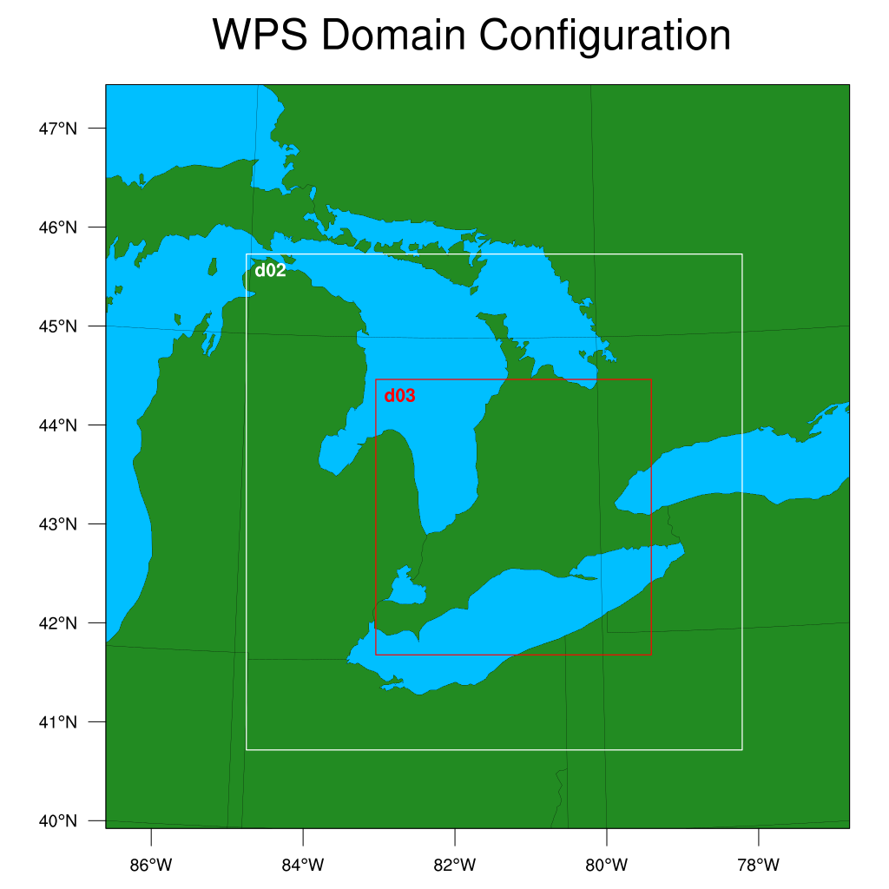
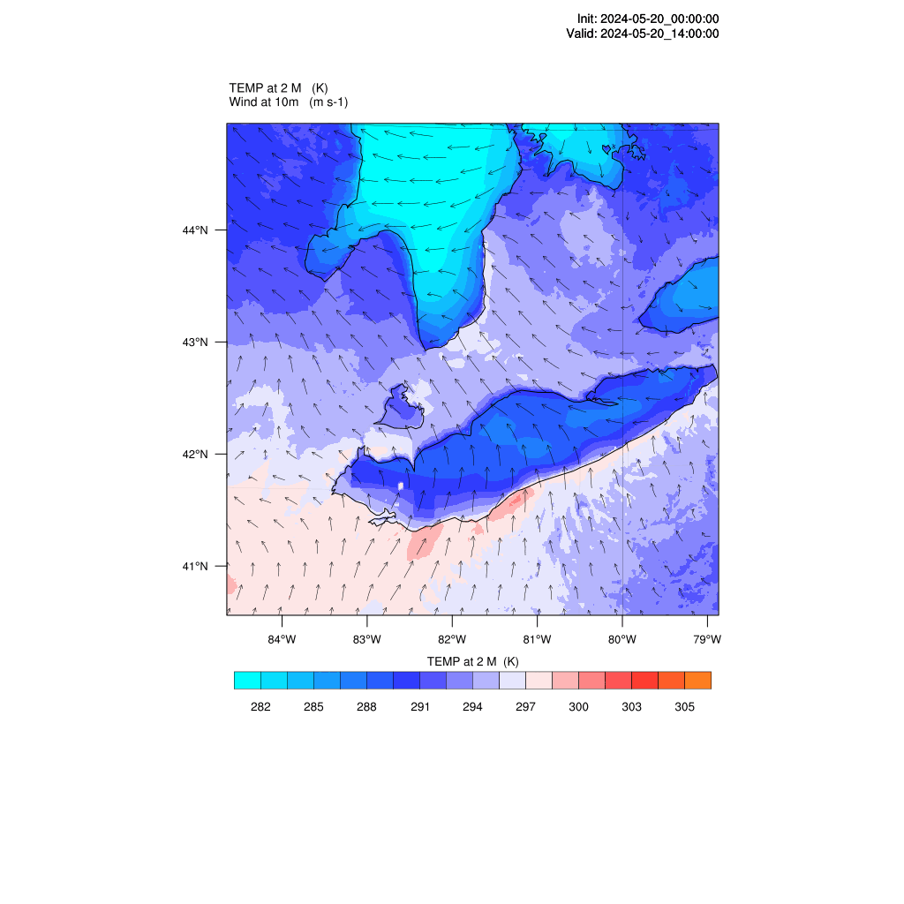
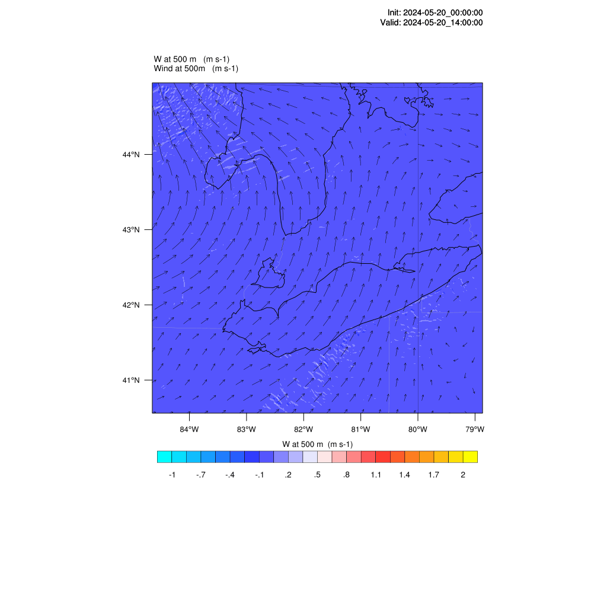
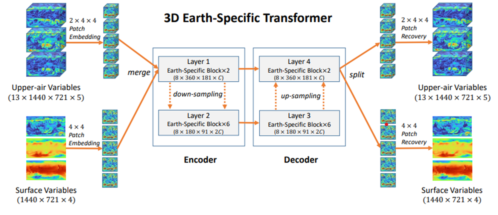
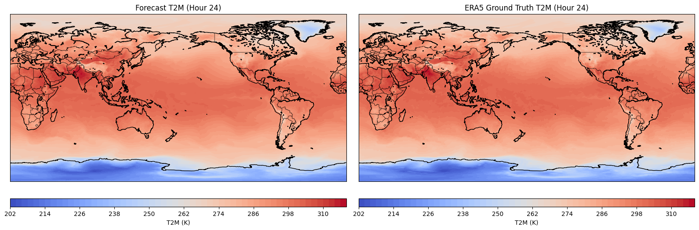
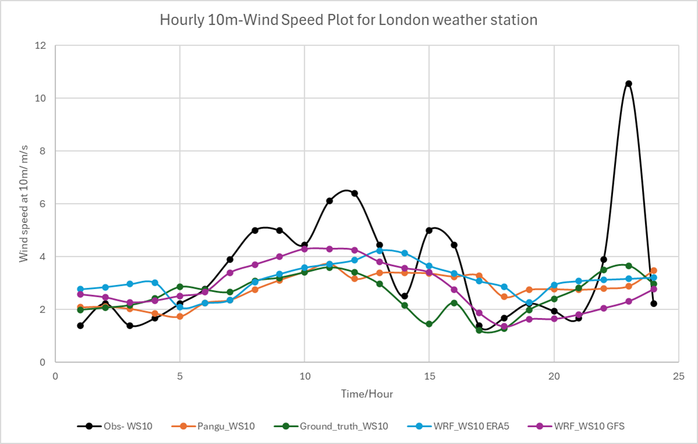
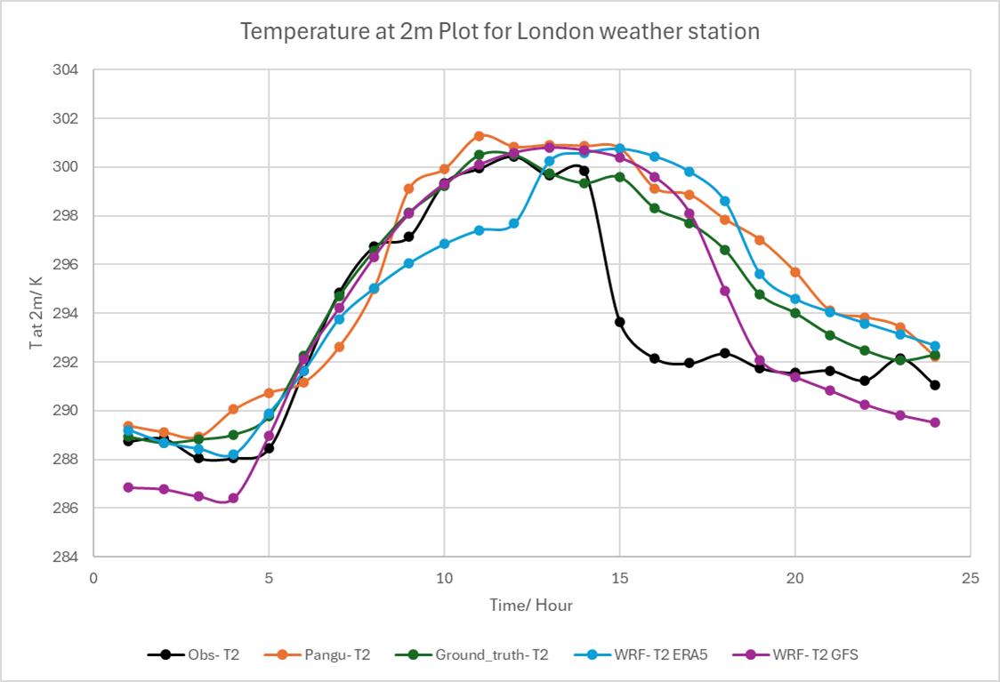
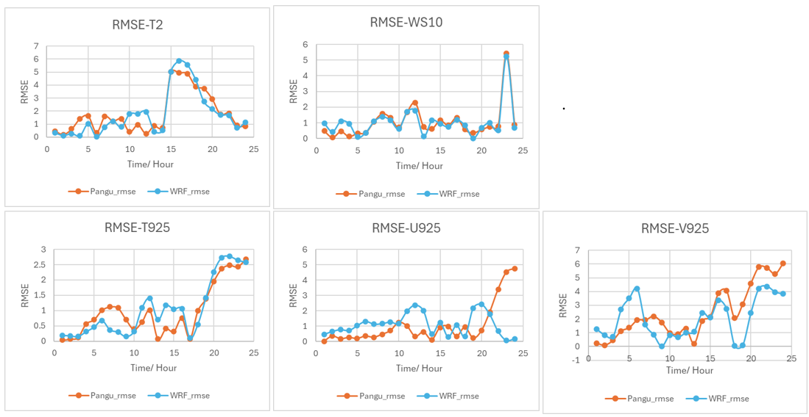
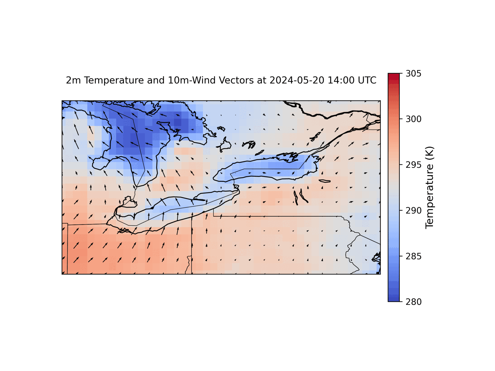
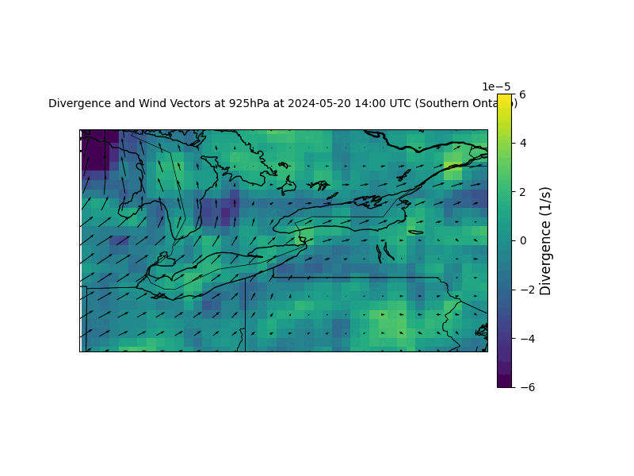

# 🌍 Comparing Lake-Breeze Simulations between WRF and Pangu-Weather / Comparaison des Simulations de Brise de Lac

**Language | Langue**: 🇺🇸 [English](#-english-version) | 🇫🇷 [Français](#-version-française)

---

## 🇺🇸 English Version

Author: [Piyush Teeloku](https://www.linkedin.com/in/piyush-teeloku/)  
Email: teelokup@gmail.com  
GitHub: [@Piyush-T31](https://github.com/Piyush-T31)

---

## 📄 Overview

This repository presents a comparative study between two weather prediction models—**WRF (Weather Research and Forecasting)** and **Pangu-Weather**, an advanced deep learning model—focused on simulating lake-breeze effects and their influence on convective storms over Southern Ontario.

---

## 📌 Objective

To assess how lake-breeze circulations impact convective storm development, and to evaluate the strengths and limitations of traditional NWP (WRF) and DLWP (Pangu-Weather) models in simulating these mesoscale phenomena.

---

## 🌊 Case Study

A storm event on **May 20, 2024** was analyzed:

- Storm tracks were evaluated using ECCC radar data.
- Specific lake-breeze effects around **Lake Huron**, **Lake Erie**, **Lake Ontario**, and **Lake St. Clair** were examined.


📍 _Figure: Radar snapshots from 6 p.m. to 12 a.m. UTC (May 20, 2024)_

---

## 🛰️ Methodology

### WRF Model Setup

- **3 nested domains** (1.0 km resolution for innermost domain)
- **Input:** ERA5 reanalysis data
- **Simulation Period:** May 20, 00:00 UTC to May 21, 06:00 UTC
- **Spin-up Time:** 12 hours
- **Output Interval:** 30 minutes


📍 _Figure: WRF nested domain setup_  

📍 _Figure: WRF surface temperature at 2m and wind field plots at 10 m_  

📍 _Figure: Vertical wind plot at 500 m with wind field plots at 500 m_

### Pangu-Weather Model

- DL model using **3D Earth-Specific Transformer (3DEST)**
- Trained on 43 years of ERA5 data
- Uses hierarchical temporal aggregation (1h, 3h, 6h, 24h models)
- Inference performed using ONNX models on both CPU and GPU


📍 _Figure: Diagram of the 3DEST architecture_

### Inference Pipeline (Python)

```python
# Run the inference session
# Initialize inputs for all models
hourly_upper_outputs = []
hourly_surface_outputs = []
input_6 , input_surface_6 = input , input_surface
input_1, input_surface_1 = input , input_surface
for i in range (24): # 1- day forecast with hourly timesteps
if (i + 1) \% 6 == 0: # Every 6 hours run the 6- hour model
11
output , output_surface = ort_session_6 . run(None , {’input ’: input_6 , ’
input_surface ’: input_surface_6 })
input_6 , input_surface_6 = output , output_surface
else : # Otherwise , run the 1- hour model
output , output_surface = ort_session_1 . run(None , {’input ’: input , ’
input_surface ’: input_surface })
# Aggregate outputs
input , input_surface = output , output_surface # Use the 1 - hour model output as
the base
# Append to lists
hourly_upper_outputs . append ( output )
hourly_surface_outputs . append ( output_surface )
# Convert lists to arrays
hourly_upper_outputs = np. array ( hourly_upper_outputs ) # Shape : (24 , ...)
hourly_surface_outputs = np. array ( hourly_surface_outputs ) # Shape : (24 , ...)
# Save the results
np. save (os. path . join ( output_data_dir , ’ hourly_upper_outputs . npy ’),
hourly_upper_outputs )
np. save (os. path . join ( output_data_dir , ’ hourly_surface_outputs .npy ’),
hourly_surface_outputs )
```

---

## 📊 Results

**Variable Validation**

- Pangu-Weather’s temperature and wind forecasts were visually and statistically close to ERA5 reanalysis
- Mean Absolute Error (MAE) and Root Mean Square Error (RMSE) were used for evaluation


📍 _Figure: Global temperature at 2m - Pangu vs ERA5 at the end of simulation (H-24)_


📍 _Figure: Hourly MAE for global temperature at 2m_

**Local Station Comparison**

- Data from London Weather Station (43.03°N, 81.15°W and 278 m elevation) was used
- Compared T2 and WS10 from observations vs WRF and Pangu-Weather
- WRF-GFS matched afternoon temperatures best; Pangu underestimated wind peaks

|       Wind speed at 10m       |     Temperature at 2m     |
| :---------------------------: | :-----------------------: |
|  |  |

📍 _Figure: Wind speed at 10m and temperature at 2m plots compared to London station data_


📍 _Figure: RMSE plots comparing Pangu-Weather station and WRF to London Weather station (T2 and WS10) and ERA5 data (U, V and T at 925 hPA)_

**Lake-Breeze Structure Comparison**

- Both models captured lake breeze onset (~16:00 UTC), peaking around 19:00 UTC
- WRF showed finer lake breeze effects due to higher spatial resolution
- Pangu-Weather showed strong convergence zones consistent with radar, despite lower resolution

|           T at 2m with 10m winds (WRF)           |       T at 2m with 10m winds (Pangu)        |
| :----------------------------------------------: | :-----------------------------------------: |
|  |  |

📍 _Figure: T2 and wind at 10 m over Southern Ontario (WRF vs Pangu)_


📍 _Figure: Divergence for Pangu-Weather over Southern Ontario at 925hPA (~500 m)_

## ✅ Conclusion

- **Pangu-Weather** is a promising, cost-effective DLWP model with competitive accuracy compared to WRF.

- WRF, though computationally expensive, provides higher-resolution and more physically constrained simulations.

- The lake-breeze did contribute to storm intensification, and both models demonstrated this to varying extents.

- Key takeaways include the importance of initial conditions, physical parameterizations, and spatial resolution.

## 🇫🇷 Version Française

# 🌀 Comparaison des Simulations de Brise de Lac entre WRF et Pangu-Weather

Auteur : [Piyush Teeloku](https://www.linkedin.com/in/piyush-teeloku/)  
Email : teelokup@gmail.com  
GitHub : [@Piyush-T31](https://github.com/Piyush-T31)

---

## 📄 Aperçu

Ce dépôt présente une étude comparative entre deux modèles de prévision météorologique — **WRF (Weather Research and Forecasting)** et **Pangu-Weather**, un modèle avancé d’apprentissage profond — axée sur la simulation des effets de brise de lac et leur influence sur les orages convectifs en Ontario méridional.

---

## 📌 Objectif

Évaluer comment les circulations de brise de lac influencent le développement des orages convectifs, et analyser les forces et limites des modèles NWP (WRF) traditionnels et DLWP (Pangu-Weather) pour simuler ces phénomènes à méso-échelle.

---

## 🌊 Étude de Cas

L’événement orageux du **20 mai 2024** a été analysé :

- Les trajectoires des orages ont été étudiées à l’aide des radars d’ECCC.
- Les effets spécifiques de brise de lac autour des **lacs Huron**, **Érié**, **Ontario** et **St. Clair** ont été examinés.


📍 _Figure : Images radar de 6 p.m à 12 a.m UTC (20 mai 2024)_

---

## 🛰️ Méthodologie

### Configuration WRF

- **3 domaines imbriqués** (résolution de 0.5 km pour le plus interne)
- **Données d’entrée :** GFS Final Analysis et ERA5
- **Période de simulation :** 20 mai 00h00 UTC au 21 mai 06h00 UTC
- **Spin-up :** 12 heures
- **Sortie toutes les 30 minutes**

📍 _Figure : Configuration des domaines WRF_  
📍 _Figure : Champs de température de surface et de vent_  
📍 _Figure : Vents verticaux à 500 m et 2 km_

### Modèle Pangu-Weather

- Modèle IA basé sur le **transformer spécifique à la Terre 3D (3DEST)**
- Entraîné sur 43 ans de données ERA5
- Utilise une agrégation temporelle hiérarchique (modèles de 1h, 3h, 6h, 24h)
- Inférence réalisée avec ONNX sur CPU et GPU

📍 _Figure : Schéma du modèle 3DEST_

### Script d’Inférence (Python)

```python
# Run the inference session
# Initialize inputs for all models
hourly_upper_outputs = []
hourly_surface_outputs = []
input_6 , input_surface_6 = input , input_surface
input_1, input_surface_1 = input , input_surface
for i in range (24): # 1- day forecast with hourly timesteps
if (i + 1) \% 6 == 0: # Every 6 hours run the 6- hour model
11
output , output_surface = ort_session_6 . run(None , {’input ’: input_6 , ’
input_surface ’: input_surface_6 })
input_6 , input_surface_6 = output , output_surface
else : # Otherwise , run the 1- hour model
output , output_surface = ort_session_1 . run(None , {’input ’: input , ’
input_surface ’: input_surface })
# Aggregate outputs
input , input_surface = output , output_surface # Use the 1 - hour model output as
the base
# Append to lists
hourly_upper_outputs . append ( output )
hourly_surface_outputs . append ( output_surface )
# Convert lists to arrays
hourly_upper_outputs = np. array ( hourly_upper_outputs ) # Shape : (24 , ...)
hourly_surface_outputs = np. array ( hourly_surface_outputs ) # Shape : (24 , ...)
# Save the results
np. save (os. path . join ( output_data_dir , ’ hourly_upper_outputs . npy ’),
hourly_upper_outputs )
np. save (os. path . join ( output_data_dir , ’ hourly_surface_outputs .npy ’),
hourly_surface_outputs )
```
